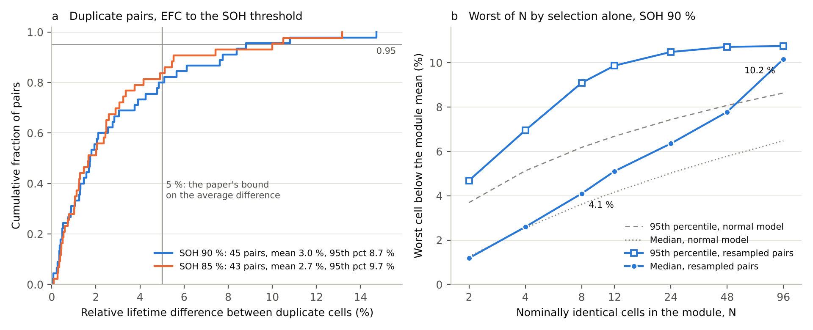

# The cell-to-cell lifetime floor in the Geslin et al. dynamic-cycling dataset

Pilot A, pre-registered. Siddharth Satte. A re-analysis of the 45 duplicate pairs in Geslin, Xu, Ganapathi, Moy, Chueh and Onori, Nature Energy 10, 172-180 (2025), from the data and code the authors released (dataset doi.org/10.25740/td676xr4322, CC BY 4.0).

**8.7 %**: the 95th percentile of the lifetime difference between duplicate cells at 90 % SOH (percentile bootstrap over pairs, 5.7 to 13.9 %).

**4.1 %**: the median shortfall of the worst of eight nominally identical cells below the module mean lifetime, by selection alone, at 90 % SOH (2.8 to 5.6 %).

(a) Cumulative distribution of the relative difference in EFC to 90 % and 85 % SOH between the two cells of each duplicate pair; the vertical line marks the 5 % bound the paper states for the average. (b) Shortfall of the worst of N identical cells below the module mean at 90 % SOH by selection alone, resampling the 90 measured pair deviations (blue) or drawing from a normal model with the fitted sigma (gray).

## Result

The average pair difference at 90 % SOH is 3.0 % (median 1.7 %), consistent with the paper's statement that it is below 5 %; recomputing the paper's Fig. 2c group averages with its released code gives all nine below 5 % (largest 4.9 %). The floor sits in the tail: 9 of 45 pairs differ by more than 5 % and 2 by more than 10 % (largest 14.7 %, periodic profile E at C/5), and the 95th percentile is 2.9 times the mean, a ratio that 45 pairs of normal noise reach in 2.6 % of draws, so the resampled worst-of-8 shortfall (4.1 %) exceeds the normal model's (3.6 %). The worse cell of a pair changes with the lifetime or fade-rate estimator in 36 of 45 pairs, pairs hold 3.0 % of the lifetime variance against 97.0 % between protocols, and removing the protocols the authors excluded moves both headline numbers by less than 0.3 points.

## Method

1. Data: the processed diagnostics released with the paper, 92 commercial SiOx-graphite/NCA cells under 47 protocols at 35 °C; 45 protocols have two cells, and cell_017 and cell_084, whose duplicates failed, are excluded by construction.
2. Lifetime: the EFC at which the C/2 capacity reaches 95, 92.5, 90, 87.5 or 85 % of its first value, after dropping every point that a later diagnostic exceeds (the paper's stated rule), by linear interpolation.
3. Pair difference: |EFC_a - EFC_b| divided by the pair mean at the same threshold; the per-cell noise sigma is the mean difference times sqrt(pi)/2, which is 2.65 % at 90 % SOH.
4. Worst of N: simulated modules of N cells whose deviations are resampled from the 90 pair deviations (half the difference, either sign, times sqrt 2) or drawn from a normal with that sigma; the shortfall is (mean minus minimum) over mean.
5. Checks: twelve lifetime and fade-rate estimators per cell; the variance split within pairs and between protocols; the paper's Fig. 2c recomputed with its own code; a second, independent implementation agrees to the last digit.
6. Pre-registration: seven predictions with bands were committed (409eba9) and pushed before the analysis ran; code, input hashes and results are at github.com/siddharth161204-wq/geslin-floor-pilot.

## Limits

1. One temperature, one cell type, lifetime from capacity only, and 45 pairs: the 95th percentile rests on the three largest pairs, and the worst of 96 (10.2 %) is set by the single largest pair, so it is an extrapolation.
2. The floor includes diagnostic measurement noise and interpolation between diagnostics up to 100 cycles apart, not only intrinsic cell variation; a pair difference is symmetric by construction, so skew in single-cell lifetimes cannot be seen.
3. The lifetime definition matters: the authors' released file of lifetimes at 90 % SOH places four cells at the first threshold crossing, up to 95 EFC earlier, and with that file the 95th percentile at 90 % SOH is 10.8 % (found while reconciling, not pre-registered).

## Prediction scorecard

| Prediction | Predicted (band) | Measured | Verdict |
|---|---|---|---|
| Mean pair difference, 90 % SOH | 3.5 % (2.5 to 5.0) | 2.99 % | Held |
| 95th percentile, 90 % SOH | 9.0 % (6.5 to 12.5) | 8.72 % | Held |
| 95th percentile, 85 % SOH | 9.5 % (6.5 to 13.5) | 9.74 % | Held |
| Per-cell sigma, 90 % SOH | 3.1 % (2.2 to 4.4) | 2.65 % | Held |
| Worst of 8, median, resampled | 4.2 % (3.0 to 6.0) | 4.10 % | Held |
| Worst of 96, median, resampled | 8.5 % (6.0 to 12.5) | 10.16 % | Held |
| Worse cell depends on the estimator | 70 % (50 to 90) | 80 % | Held |
| Within-pair variance share, 90 % SOH | 1.5 % (0.4 to 4.0) | 2.99 % | Held |
| Tail: 95th percentile / mean above 2.33 | 2.6 | 2.91 | Held |

The tail was heavier than predicted: the ratio also passed 2.80, the value only 5 % of normal datasets reach, which I had not expected (unscored); the within-pair share was twice the point prediction.

## What it means for the thesis

Under one protocol at 35 °C, the worst of eight nominally identical cells already falls 4.1 % below the module mean lifetime by chance alone, and one duplicate pair in five differs by more than 5 %, so a thermal account of cell-to-cell divergence in a module has to produce gaps beyond this floor before it can be told apart from selection. Because the worse cell of a pair changes with the lifetime estimator in four pairs out of five, the thesis comparison of resolved and lumped module models will fix its lifetime definition in advance and test the worst-cell gap against this floor, not against an average.

Code: MIT. Note, figure and results: CC BY 4.0. Data: Geslin, A., Xu, L., Ganapathi, D., Moy, K., Chueh, W. & Onori, S. Dataset - Dynamic cycling enhances battery lifetime. Stanford Digital Repository (2024), CC BY 4.0.
